# Raspberry Pi Imager

### 1. Once you’ve installed Imager, launch the application by clicking the Raspberry Pi Imager icon or running rpi-imager.

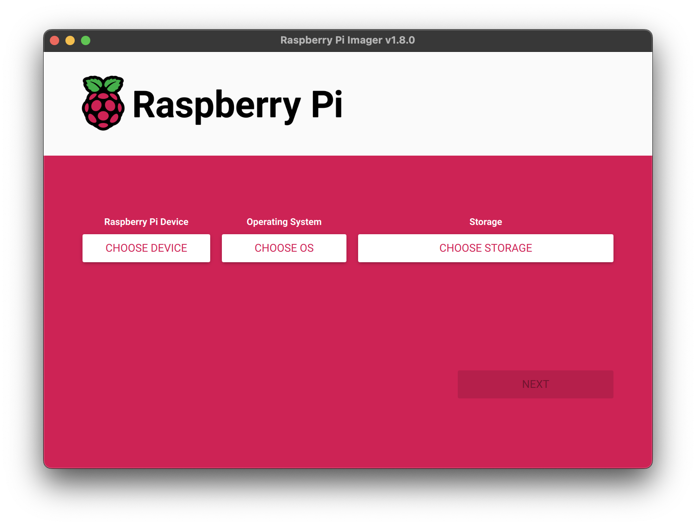

### 2. Click Choose device and select your Raspberry Pi model from the list.

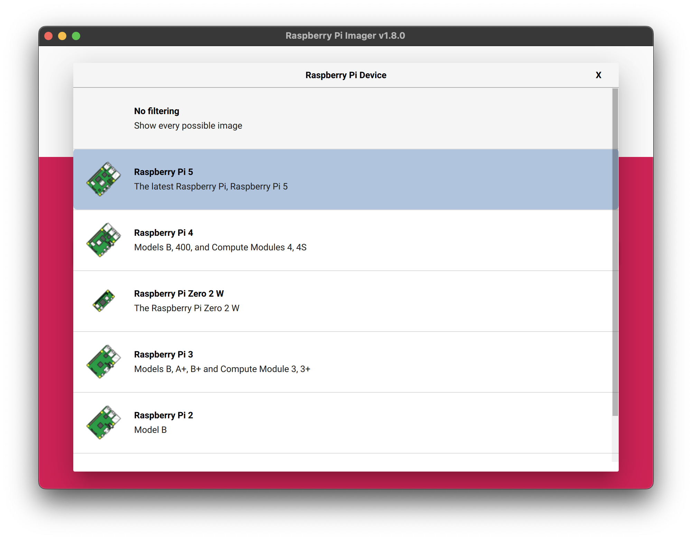

### 3. Next, click Choose OS and select an operating system to install. Imager always shows the recommended version of Raspberry Pi OS for your model at the top of the list.

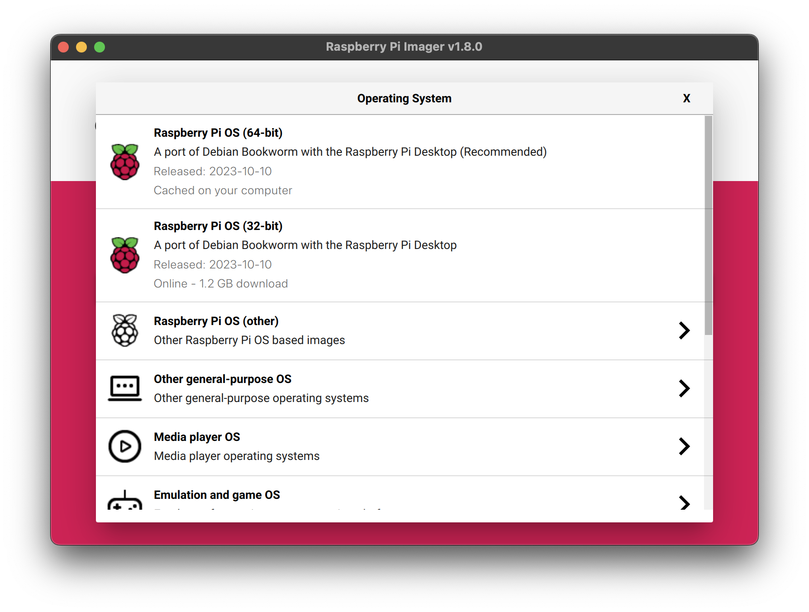

### 4. Connect your preferred storage device to your computer. For example, plug a microSD card in using an external or built-in SD card reader. Then, click Choose storage and select your storage device.

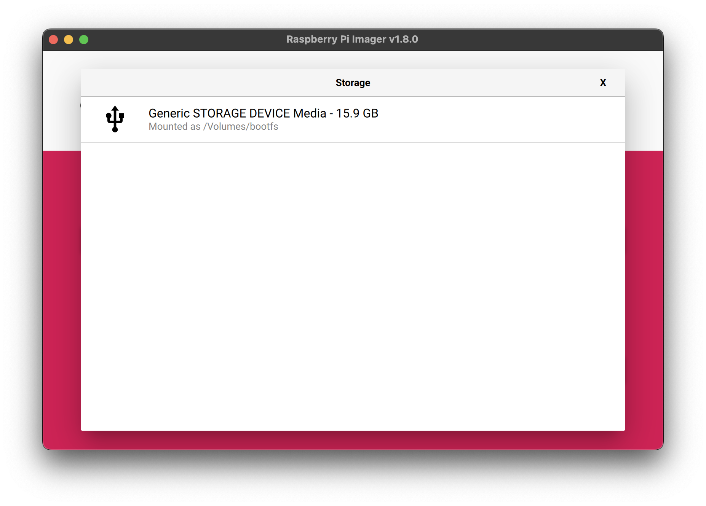

### 5. Next, click Next.
### 6. In a popup, Imager will ask you to apply OS Customisation. We strongly recommend configuring your Raspberry Pi via the OS customisation settings. Click the Edit Settings button to open OS Customisation. If you don’t configure your Raspberry Pi via OS customisation settings, Raspberry Pi OS will ask you for the same information at first boot during the configuration wizard. You can click the No button to skip OS Customisation.

#### For more details in OS Customisation, move to [OS Customisation](#os-customisation) section.

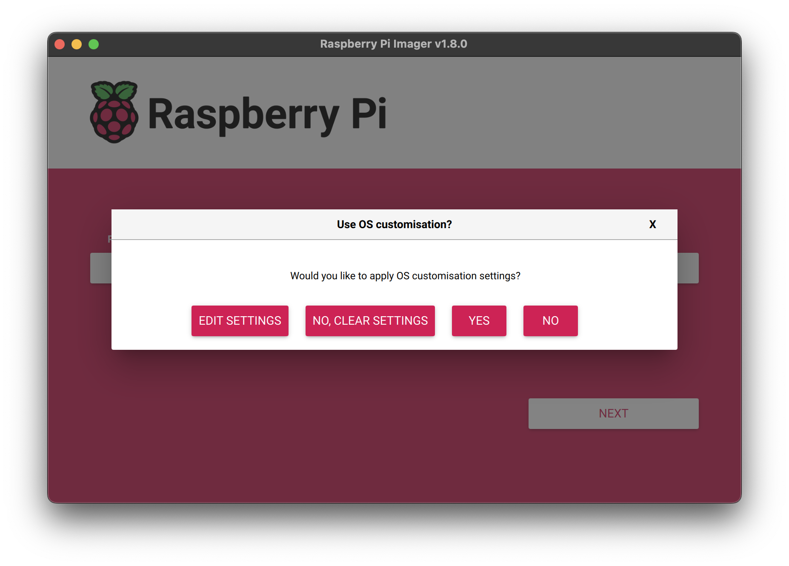

### 7. When you’ve finished entering OS customisation settings, click Save to save your customisation. Then, click Yes to apply OS customisation settings when you write the image to the storage device. Finally, respond Yes to the "Are you sure you want to continue?" popup to begin writing data to the storage device. If you see an admin prompt asking for permissions to read and write to your storage medium, grant Imager the permissions to proceed.

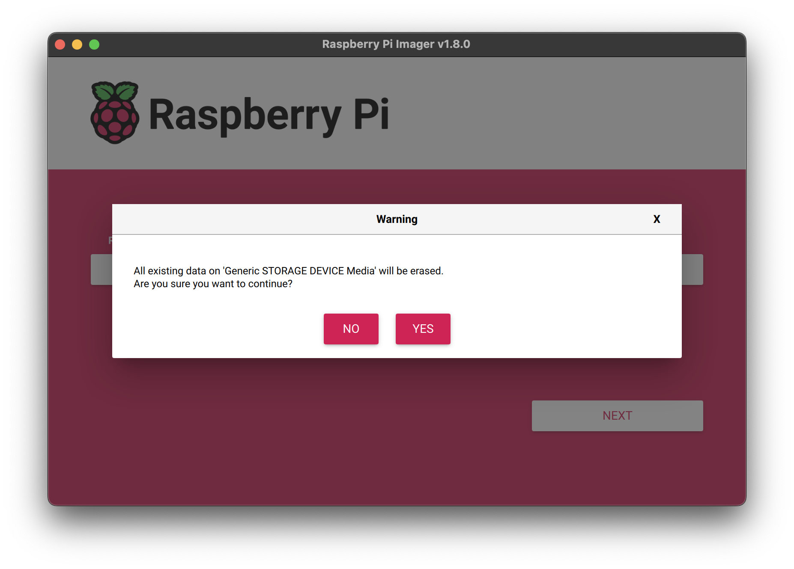

### 8. Grab a cup of coffee or go for a walk. This could take a few minutes.

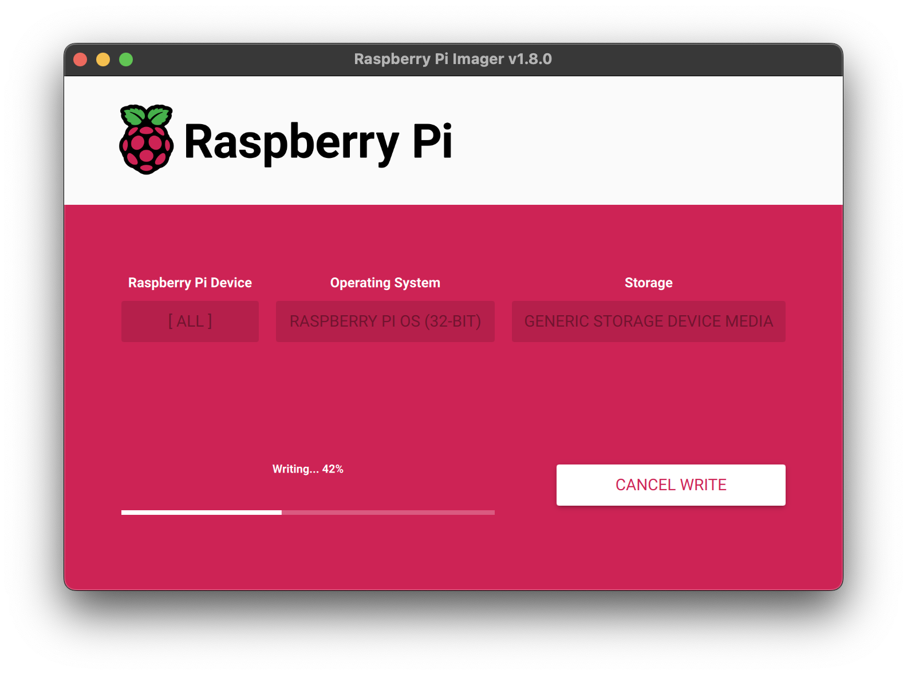
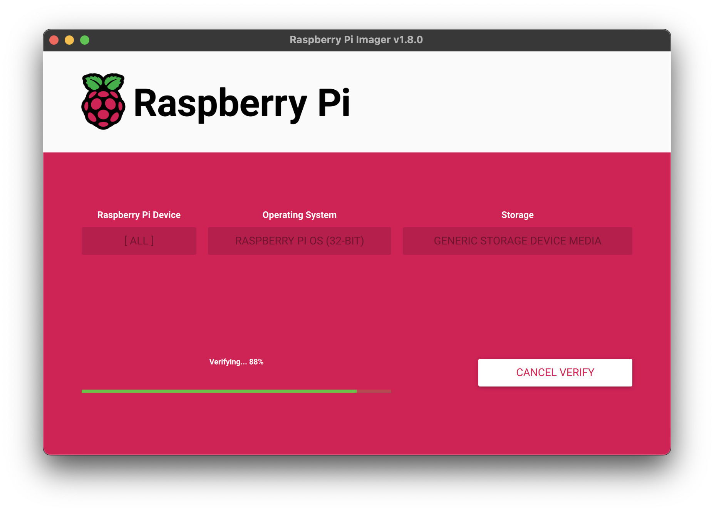

### 9. When you see the "Write Successful" popup, your image has been completely written and verified. You’re now ready to boot a Raspberry Pi from the storage device!

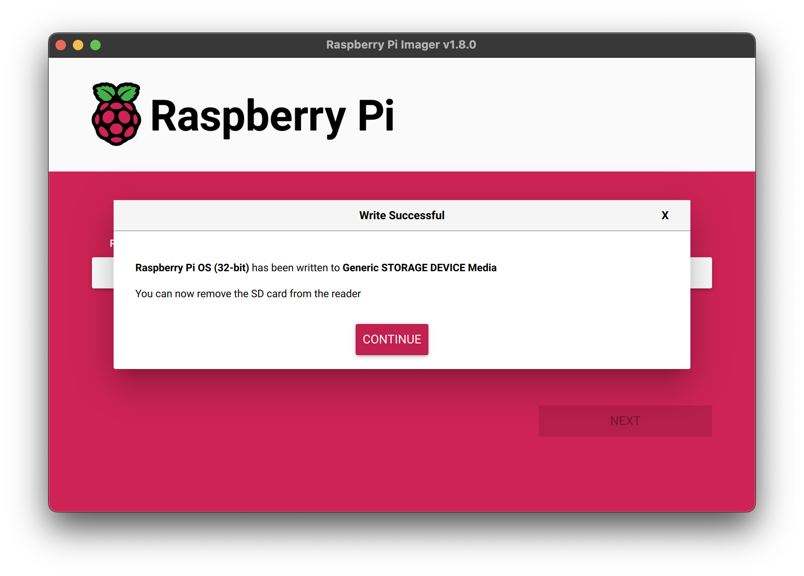

# OS Customisation

## The OS customisation menu lets you set up your Raspberry Pi before first boot. You can preconfigure:

#### 1. A username and password

#### 2. Wi-Fi credentials

#### 3. The device hostname

#### 4. The time zone

#### 5. Your keyboard layout

#### 6. Remote connectivity

### General

When you first open the OS customisation menu, you might see a prompt asking for permission to load Wi-Fi credentials from your host computer. If you respond "yes", Imager will prefill Wi-Fi credentials from the network you’re currently connected to. If you respond "no", you can enter Wi-Fi credentials manually.

The hostname option defines the hostname your Raspberry Pi broadcasts to the network using mDNS. When you connect your Raspberry Pi to your network, other devices on the network can communicate with your computer using <hostname>.local or <hostname>.lan.

The username and password option defines the username and password of the admin user account on your Raspberry Pi.

The wireless LAN option allows you to enter an SSID (name) and password for your wireless network. If your network does not broadcast an SSID publicly, you should enable the "Hidden SSID" setting. By default, Imager uses the country you’re currently in as the "Wireless LAN country". This setting controls the Wi-Fi broadcast frequencies used by your Raspberry Pi. Enter credentials for the wireless LAN option if you plan to run a headless Raspberry Pi.

The locale settings option allows you to define the time zone and default keyboard layout for your Pi.

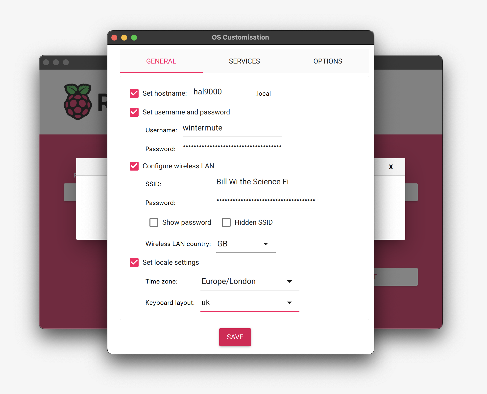

### Services

The Services tab includes settings to help you connect to your Raspberry Pi remotely.

If you plan to use your Raspberry Pi remotely over your network, check the box next to Enable SSH. You should enable this option if you plan to run a headless Raspberry Pi.

Choose the password authentication option to SSH into your Raspberry Pi over the network using the username and password you provided in the general tab of OS customisation.

Choose Allow public-key authentication only to preconfigure your Raspberry Pi for passwordless public-key SSH authentication using a private key from the computer you’re currently using. If already have an RSA key in your SSH configuration, Imager uses that public key. If you don’t, you can click Run SSH-keygen to generate a public/private key pair. Imager will use the newly-generated public key.

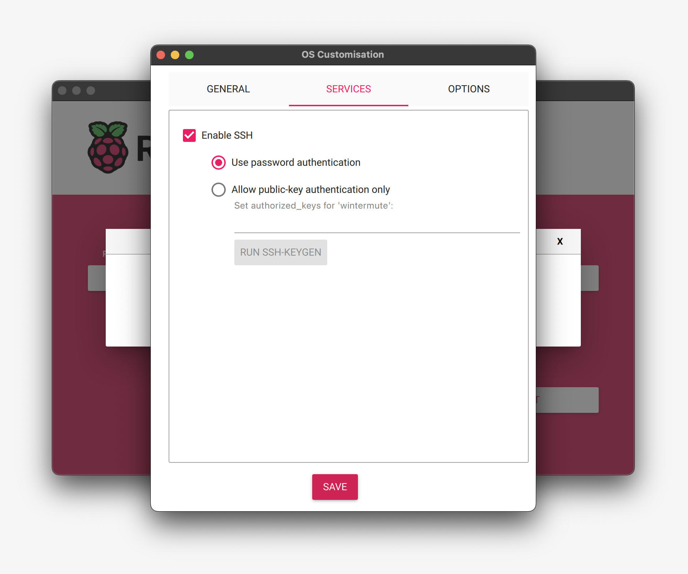

### Options

OS customisation also includes an Options menu that allows you to configure the behaviour of Imager during a write. These options allow you to play a noise when Imager finishes verifying an image, to automatically unmount storage media after verification, and to disable telemetry.

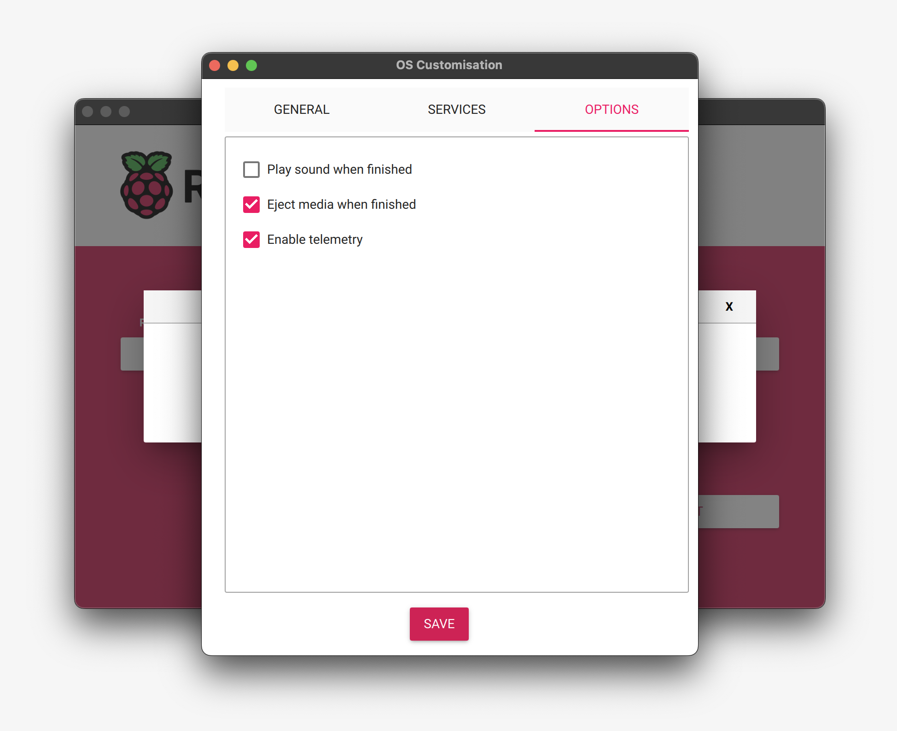